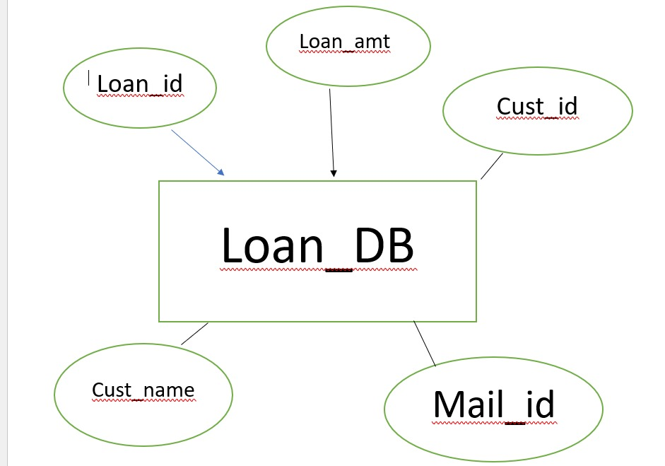

# Ex02 Django ORM Web Application
# Date:
# AIM
To develop a Django application to store and retrieve data from a bank loan database using Object Relational Mapping(ORM).

# ENTITY RELATIONSHIP DIAGRAM

## DESIGN STEPS
## STEP 1:
Clone the problem from GitHub

## STEP 2:
Create a new app in Django project

## STEP 3:
Enter the code for admin.py and models.py
```
from django.contrib import admin
from .models import Loan_DB

class Loan_DBAdmin(admin.ModelAdmin):
    list_display = ('loan_id', 'borrower', 'amount', 'loan_date')  # Customize with your fields
    search_fields = ('borrower', 'loan_id')  # Fields you want to be searchable
    list_filter = ('loan_date',)  # Fields to filter by

admin.site.register(Loan_DB, Loan_DBAdmin)

from django.db import models

class Loan_DB(models.Model):
    loan_id = models.CharField(max_length=50)
    borrower = models.CharField(max_length=100)
    amount = models.DecimalField(max_digits=10, decimal_places=2)
    loan_date = models.DateField()

    def __str__(self):
        return self.loan_id

```

## STEP 4:
Execute Django admin and create details for 10 books

# PROGRAM
```
from django.contrib import admin
from .models import Loan_DB

class Loan_DBAdmin(admin.ModelAdmin):
    list_display = ('loan_id', 'borrower', 'amount', 'loan_date')  # Customize with your fields
    search_fields = ('borrower', 'loan_id')  # Fields you want to be searchable
    list_filter = ('loan_date',)  # Fields to filter by

admin.site.register(Loan_DB, Loan_DBAdmin)

from django.db import models

class Loan_DB(models.Model):
    loan_id = models.CharField(max_length=50)
    borrower = models.CharField(max_length=100)
    amount = models.DecimalField(max_digits=10, decimal_places=2)
    loan_date = models.DateField()

    def __str__(self):
        return self.loan_id

```

# OUTPUT


# RESULT
Thus the program for creating a database using ORM hass been executed successfully

